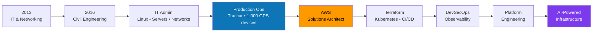
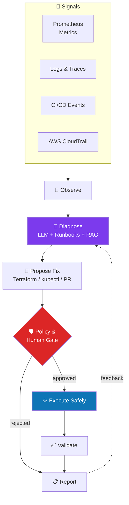
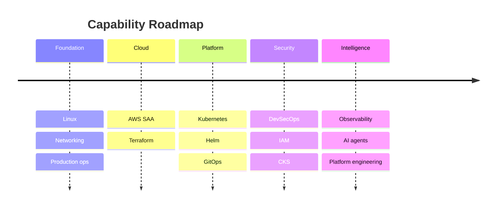

<!-- ============ HEADER ============ -->
<div align="center">


<a href="https://git.io/typing-svg">

</a>

<br/>


</div>

---

## 🧬 `whoami`

```bash
$ whoami
muhammed-hanas

$ cat /etc/profile.d/identity.sh
ROLE="Cloud / Platform Engineer"
ORIGIN="IT Infrastructure -> Production Ops -> Cloud-Native"
BACKGROUND="Civil Engineer by degree, infrastructure engineer by craft"
PRODUCTION_PROOF="~1,000 GPS devices on a live Traccar platform"
FOCUS="AWS | Terraform | Kubernetes | DevSecOps | Observability | AI Ops"
MISSION="Make infrastructure self-aware, self-secure and self-healing"
```

> I started with routers, Linux boxes and broken networks. Today I design the platforms that keep systems alive, and I'm teaching those platforms to think.

---

## 🧭 The Journey



---

## 🎯 Mission Control

<table>
<tr>
<td width="50%" valign="top">

### 🔭 Currently building
- 🏗️ **Multi-environment AWS landing zone** with reusable Terraform modules and remote state
- ☸️ **Production-grade Kubernetes platform** with RBAC, NetworkPolicy, HPA, PDB and Helm
- 🤖 **AI Ops agent** that observes, diagnoses, proposes and safely executes
- 🔐 **DevSecOps pipeline** with SAST, SCA, container and IaC scanning

</td>
<td width="50%" valign="top">

### 🧪 Deliberately going deep on
- Terraform at scale (modules, workspaces, policy-as-code)
- Kubernetes internals (CRDs, Operators, scheduling)
- Observability (SLOs, alerting, tracing)
- Python for infrastructure automation

</td>
</tr>
<tr>
<td width="50%" valign="top">

### 🌱 Learning path
`CKA` → `Terraform Associate` → `AWS DevOps Pro` → `CKS` → `AWS Security Specialty`

</td>
<td width="50%" valign="top">

### 💬 Ask me about
Linux troubleshooting, AWS architecture, Terraform design, Kubernetes security, fleet and IoT infrastructure, AI agents for ops

</td>
</tr>
</table>

---

## 🛠️ Tech Arsenal

<div align="center">

### ☁️ Cloud & Infrastructure as Code


### ☸️ Containers & Orchestration


### 🔄 CI/CD & DevSecOps


### 📊 Observability


### 🐧 Systems, Scripting & AI


</div>

---

## 🏗️ Engineering Philosophy

<table>
<tr>
<td align="center" width="25%">

### 🧱<br/>Everything as Code
If it can't be versioned, reviewed and reproduced, it isn't finished.

</td>
<td align="center" width="25%">

### 🔐<br/>Secure by Default
Security is a stage in the pipeline, not a ticket after the incident.

</td>
<td align="center" width="25%">

### 📡<br/>Observable by Design
Know it's failing before the customer does.

</td>
<td align="center" width="25%">

### 🤖<br/>Automate, Then Augment
Automate the routine. Let AI assist with the judgment calls, with humans approving risk.

</td>
</tr>
</table>

---

## 🧠 Flagship Vision: AI-Powered Platform Engineering

An agent-driven operations loop with a human approval gate on anything risky.



---

## 🚀 Featured Projects

| Project | What it does | Stack |
|---|---|---|
| 🛰️ **[fleet-platform-aws](https://github.com/YOUR_USERNAME/fleet-platform-aws)** | Production-style, scalable GPS/IoT telemetry platform modeled on real ~1,000-device Traccar operations | `AWS` `Terraform` `RDS` `ALB` |
| ☸️ **[k8s-production-platform](https://github.com/YOUR_USERNAME/k8s-production-platform)** | Hardened cluster blueprint: RBAC, NetworkPolicy, PDB, HPA, Pod Security, Helm | `Kubernetes` `Helm` `Argo CD` |
| 🔐 **[devsecops-pipeline](https://github.com/YOUR_USERNAME/devsecops-pipeline)** | End-to-end secure delivery: SAST, dependency, container and IaC scanning with quality gates | `Jenkins` `SonarQube` `Trivy` |
| 📊 **[observability-stack](https://github.com/YOUR_USERNAME/observability-stack)** | Metrics, dashboards and alerting with node, container and cluster exporters | `Prometheus` `Grafana` |
| 🤖 **[ai-ops-agent](https://github.com/YOUR_USERNAME/ai-ops-agent)** | Agent that diagnoses incidents and proposes safe remediations with approval gates | `Python` `LLM` `RAG` |
| 🧩 **[terraform-aws-modules](https://github.com/YOUR_USERNAME/terraform-aws-modules)** | Reusable, tested Terraform modules with remote state and multi-env layout | `Terraform` `S3` `DynamoDB` |

<sub>Replace each link with your real repository as you ship it.</sub>

---

## 🏅 Certifications & Roadmap

| Status | Credential |
|:---:|---|
| ✅ | **AWS Certified Solutions Architect – Associate** |
| 🔄 | **HashiCorp Terraform Associate** |
| 🎯 | **Certified Kubernetes Administrator (CKA)** |
| 🎯 | **AWS Certified DevOps Engineer – Professional** |
| 🎯 | **Certified Kubernetes Security Specialist (CKS)** |
| 🎯 | **AWS Certified Security – Specialty** |



---

## 📈 GitHub Stats

<div align="center">


</div>

---

## 🧩 Daily Operating System

```yaml
mornings:   "Deep work: one hard topic, one real lab"
build:      "Ship small, ship often, document everything"
rule_1:     "Depth over breadth: master the core before adding tools"
rule_2:     "A project isn't done until it is deployed, monitored and documented"
rule_3:     "Every certification must be backed by a repo"
focus_stack: [AWS, Terraform, Kubernetes, CI/CD, DevSecOps, Observability]
```

---

## 🤝 Let's Connect

<div align="center">

[](https://linkedin.com/in/YOUR_HANDLE)
[](mailto:YOUR_EMAIL)
[](https://YOUR_SITE)

<br/>

> *"Build infrastructure. Automate operations. Secure everything. Observe everything. Use AI intelligently."*


</div>
