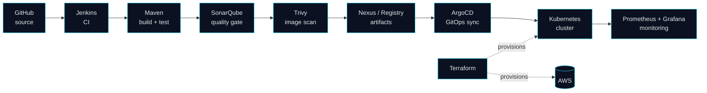

 

---

## 👋 About me

I'm an infrastructure engineer with **5 years of hands-on IT operations experience** (2021–2026) running servers, networks and hosting for a live business, now moving that foundation into **cloud-native DevOps**: infrastructure as code, CI/CD, containers, GitOps and observability.

My route in is unusual: a **civil engineering** degree (2016), then infrastructure. I treat systems the way I was trained to treat structures: design for load, document the assumptions, and test before you rely on it.

- 🏗️ **Run in production:** Linux/Ubuntu servers, MySQL, web hosting, networking, a **Traccar GPS platform serving ~1,000 devices**, remote equipment monitoring
- 🛠️ **Building hands-on projects:** Terraform on AWS, Kubernetes (Kind), a Jenkins → SonarQube → Trivy → Nexus pipeline, ArgoCD, Prometheus + Grafana
- 🎓 **Studied and practiced hands-on:** infrastructure as code, Kubernetes, CI/CD, GitOps, observability and DevSecOps, each documented in my repos
- 🎯 **Looking for:** DevOps / Cloud / Platform / Infrastructure engineering roles in the UAE

> **How to read this profile:** 🟢 **Production** = run in a live environment. 🛠️ **Hands-on projects** = studied, built and tested in my own environment, documented on GitHub.

---

## 🛠️ Tech stack

 

| Area | Tools | Level of evidence |
|---|---|---|
| **Systems & hosting** | Linux/Ubuntu, Windows troubleshooting, MySQL, WordPress, CyberPanel, domains & DNS | 🟢 Production (5 yrs) |
| **Networking & monitoring** | Routers, access points, remote equipment monitoring | 🟢 Production |
| **Platform** | Traccar GPS tracking (~1,000 devices) | 🟢 Production |
| **Cloud** | AWS EC2, architecture design (Solutions Architect – Associate certified) | 🟢 Basic EC2 in production · 🛠️ Hands-on projects for the rest |
| **Infrastructure as Code** | Terraform on AWS | 🛠️ Hands-on projects |
| **Containers** | Docker, Docker Compose, Kubernetes (Kind) | 🛠️ Hands-on projects |
| **CI/CD** | Jenkins, Maven, SonarQube | 🛠️ Hands-on projects |
| **GitOps** | ArgoCD, Git workflows | 🛠️ Hands-on projects |
| **Observability** | Prometheus, Grafana, alerting | 🛠️ Hands-on projects |
| **DevSecOps** | Trivy image scanning, SonarQube quality gates | 🛠️ Hands-on projects |
| **Artifacts** | Nexus Repository, Amazon ECR | 🛠️ Hands-on projects |
| **Scripting** | Python, Bash | 🛠️ Hands-on projects |

<!-- Update the "Level of evidence" column whenever a skill is proven in a live environment. -->

---

## 🔁 DevOps pipeline project

The end-to-end flow I'm building and documenting on GitHub:

> 🛠️ This is a **portfolio project**. Each stage is documented with evidence (logs, screenshots, run output) as it is verified.

---

## 🚀 Featured work

### 🟢 Traccar GPS tracking platform: production case study
Designed and ran a self-hosted **Traccar** platform supporting **~1,000 tracked devices**, including the server, database and remote monitoring around it.
**Status:** architecture write-up in progress (design, hardening, monitoring, lessons learned).

### 🛠️ DevOps pipeline: Kind + Jenkins + SonarQube + Nexus + Trivy + monitoring
Ubuntu 24.04 environment running a Kubernetes (Kind) cluster with a full CI/CD toolchain and monitoring.

### 🛠️ Terraform on AWS
Infrastructure-as-code projects on AWS (modules, remote state, secure defaults).

### 🛠️ Side project: AI-assisted DevOps assistant (in design)
A read-only assistant for AWS and Kubernetes health checks and Terraform plan review, designed around **least privilege and human approval**.

---

## 🏭 Production experience

| Period | Role | What I did |
|---|---|---|
| **2021 – 2026** | IT Administrator / Infrastructure (independent, small company) | Ran Linux and Windows systems, networking, local servers, hosting and control panels, MySQL and WordPress, and remote monitoring. Implemented the Traccar platform. Connected industrial control panels and machines to servers. |
| **2016 – ~2017** | Civil engineer | About 1.5 years in civil engineering before moving to IT. |

---

## 🎓 Certifications

| | Status |
|---|---|
| ✅ AWS Certified Solutions Architect – Associate | Passed |

---

## 📊 GitHub stats

---

## 🐍 Contribution snake

  <picture>
    <source media="(prefers-color-scheme: dark)" srcset="https://raw.githubusercontent.com/muhammedhanas/muhammedhanas/output/github-snake-dark.svg"/>
    
  </picture>

---

## 📐 How I document every project

Every portfolio repo aims to include: **README · architecture diagram · setup steps · security notes · troubleshooting log · evidence of a successful run · known limitations · cleanup instructions.**

---

## 🤝 Let's connect

<!-- Add your own links, then remove the comment markers:

-->

Open to DevOps · Cloud · Platform · Infrastructure roles in the UAE

